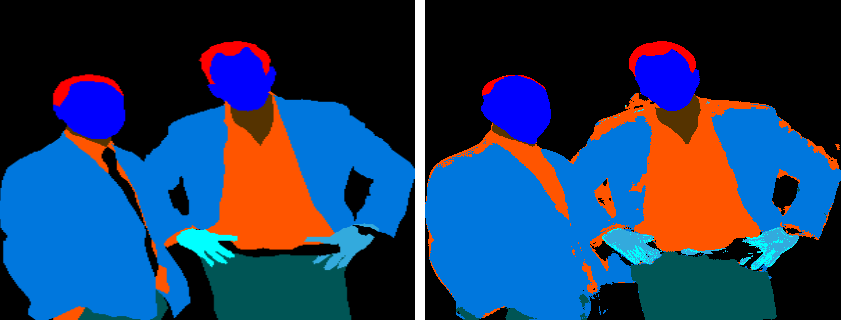
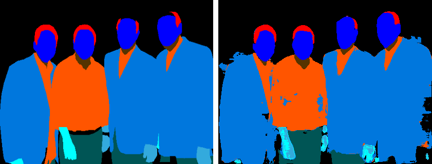
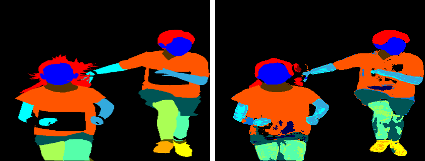
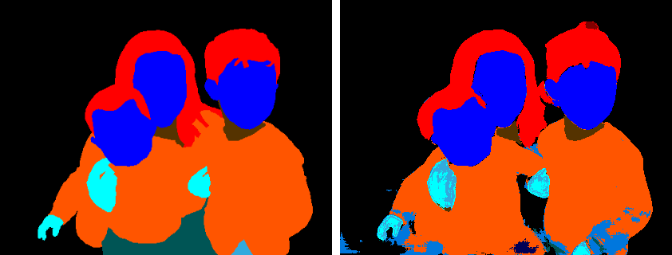
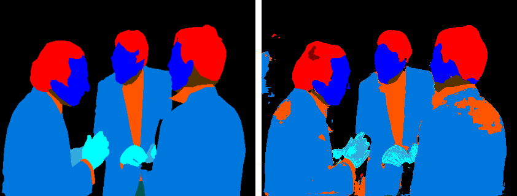
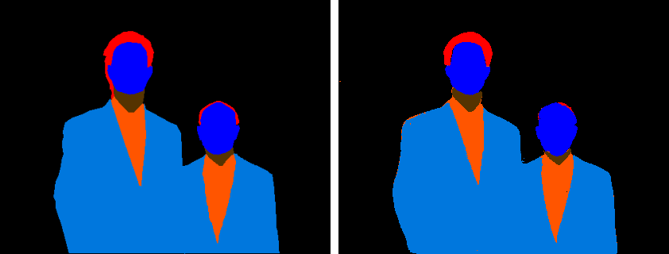

# MulticlassSegment

This project focuses on performing multiclass segmentation on images using two different neural network architectures: U-Net and a custom-designed segmentation network. The goal is to accurately segment objects in images into various classes.

## Overview

Program language: Python

Framework: tensorflow

Model architecture:

In this project, I explore two different neural network architectures for multiclass segmentation:

1. U-Net: consists of an encoder-decoder structure that captures both local and global features for accurate segmentation.

2. Custom Segmentation Network: Apart from U-Net, I design and implement a custom neural network architecture tailored to the specific multiclass segmentation task.

## Installation

pip install -r requirements.txt

## How to use

### Training 
To train the model, execute the following command:

``` python /path/to/train.py --config "/path/to/config/file" ```

### Test
To perform testing, use the following command:

```python /path/to/test.py --config "/path/to/config/file" ```

## Result











